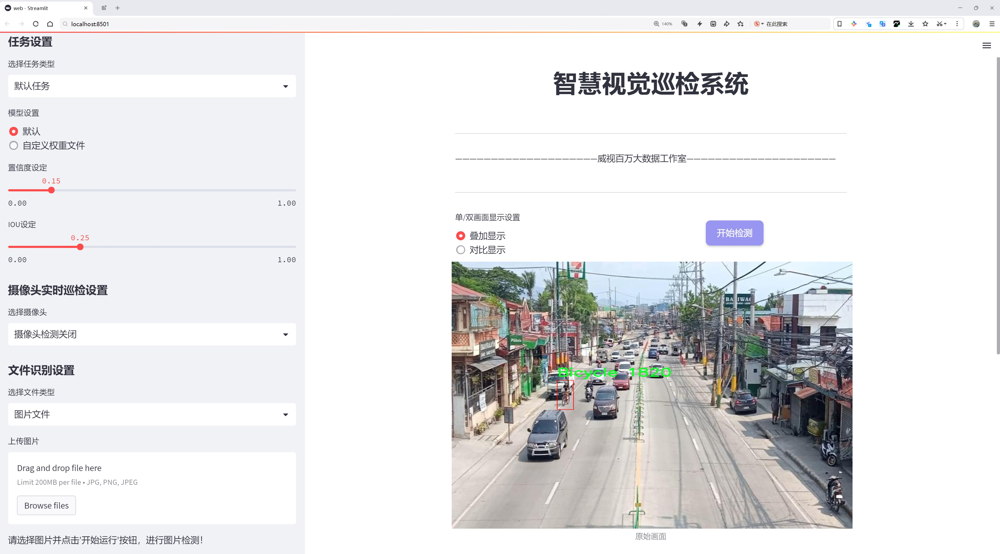
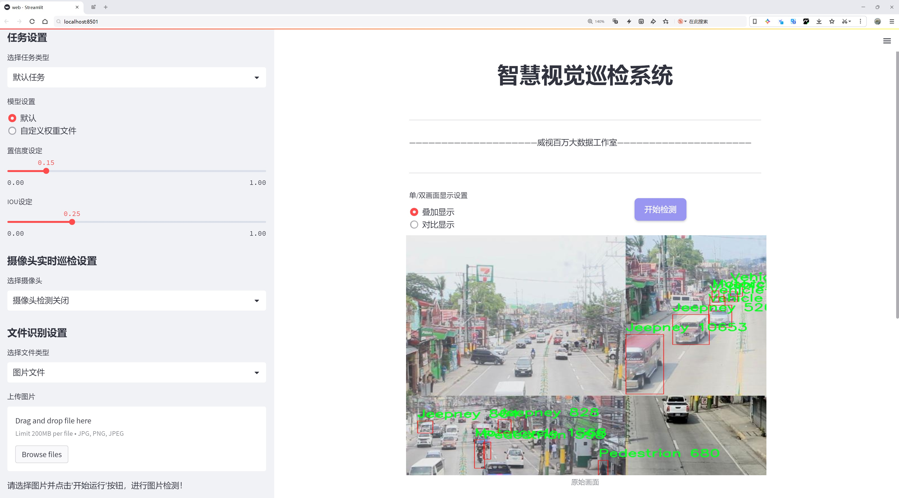
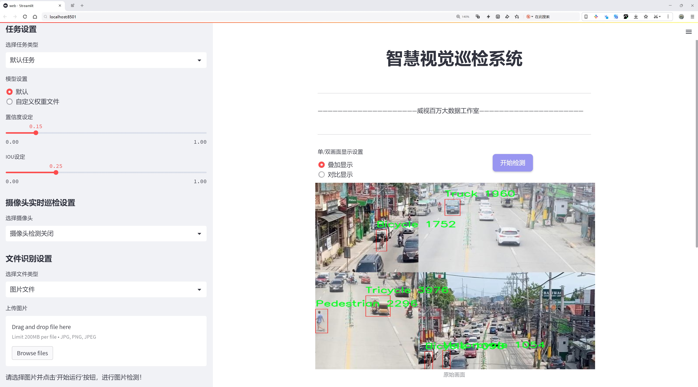
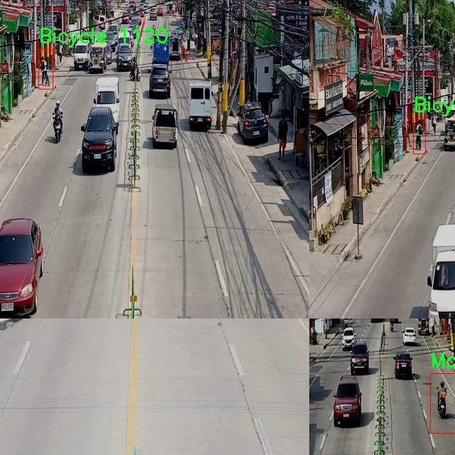
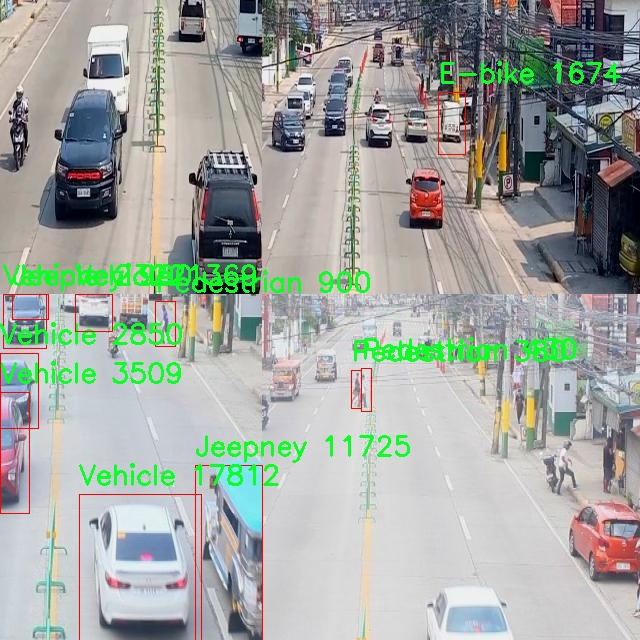
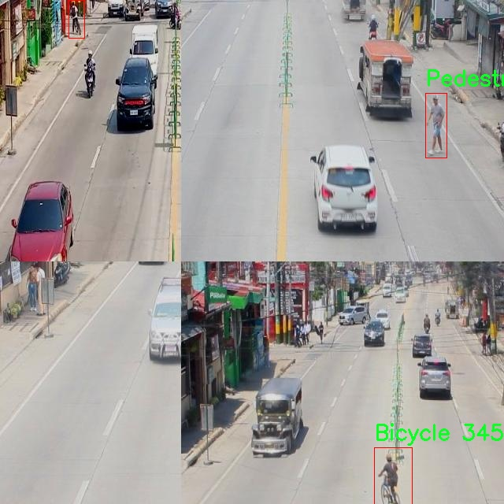
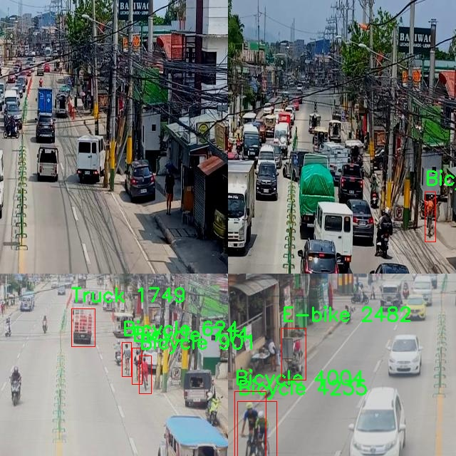

# 交通流量监测检测系统源码分享
 # [一条龙教学YOLOV8标注好的数据集一键训练_70+全套改进创新点发刊_Web前端展示]

### 1.研究背景与意义

项目参考[AAAI Association for the Advancement of Artificial Intelligence](https://gitee.com/qunmasj/projects)

项目来源[AACV Association for the Advancement of Computer Vision](https://github.com/qunshansj/good)

研究背景与意义

随着城市化进程的加快，交通流量的监测与管理成为现代城市发展的重要课题。交通流量的有效监测不仅能够提高交通管理的效率，还能为城市规划、环境保护和公共安全提供重要的数据支持。传统的交通监测方法多依赖于人工观察和固定摄像头，这些方法在准确性、实时性和覆盖范围上均存在一定的局限性。因此，基于计算机视觉和深度学习技术的自动化交通流量监测系统逐渐成为研究的热点。

近年来，YOLO（You Only Look Once）系列目标检测算法因其高效性和实时性在交通监测领域得到了广泛应用。YOLOv8作为该系列的最新版本，进一步提升了检测精度和速度，能够在复杂的交通环境中快速识别和分类多种交通参与者。然而，现有的YOLOv8模型在特定场景下仍然面临着检测精度不足和对小目标识别能力弱等问题。因此，针对这些不足，改进YOLOv8模型以提升其在交通流量监测中的应用效果显得尤为重要。

本研究基于一个包含7354张图像的交通密度数据集，涵盖了8类交通参与者，包括自行车、电动自行车、吉普车、摩托车、行人、三轮车、卡车和车辆。这一数据集的多样性为模型的训练和测试提供了丰富的样本，有助于提高模型的泛化能力和适应性。通过对数据集的深入分析，可以识别出不同交通参与者在各种交通环境下的特征，从而为改进YOLOv8模型提供数据支持。

本研究的意义不仅在于提升交通流量监测的技术水平，更在于为智能交通系统的建设提供可行的解决方案。通过改进YOLOv8模型，能够实现对交通流量的实时监测与分析，为交通管理部门提供准确的数据支持，进而优化交通信号控制、减少交通拥堵、提高道路安全性。此外，研究成果还可以为城市规划提供参考依据，帮助决策者制定更为科学的交通政策，促进可持续发展。

综上所述，基于改进YOLOv8的交通流量监测系统的研究，不仅具有重要的理论价值，还有着广泛的应用前景。通过本研究，期望能够推动交通监测技术的进步，为智慧城市的建设贡献力量。同时，研究过程中积累的数据和经验也将为后续相关研究提供宝贵的参考，促进交通工程和计算机视觉领域的交叉融合。

### 2.图片演示







##### 注意：由于此博客编辑较早，上面“2.图片演示”和“3.视频演示”展示的系统图片或者视频可能为老版本，新版本在老版本的基础上升级如下：（实际效果以升级的新版本为准）

  （1）适配了YOLOV8的“目标检测”模型和“实例分割”模型，通过加载相应的权重（.pt）文件即可自适应加载模型。

  （2）支持“图片识别”、“视频识别”、“摄像头实时识别”三种识别模式。

  （3）支持“图片识别”、“视频识别”、“摄像头实时识别”三种识别结果保存导出，解决手动导出（容易卡顿出现爆内存）存在的问题，识别完自动保存结果并导出到tempDir中。

  （4）支持Web前端系统中的标题、背景图等自定义修改，后面提供修改教程。

  另外本项目提供训练的数据集和训练教程,暂不提供权重文件（best.pt）,需要您按照教程进行训练后实现图片演示和Web前端界面演示的效果。

### 3.视频演示

[3.1 视频演示](https://www.bilibili.com/video/BV1AusNezEMi/?vd_source=ff015de2d29cbe2a9cdbfa7064407a08)

### 4.数据集信息展示

数据集信息展示

本数据集旨在为改进YOLOv8的交通流量监测系统提供强有力的支持，专注于交通密度的分析与识别。该数据集包含7354幅高质量图像，涵盖了多种交通参与者和车辆类型，能够有效地帮助研究人员和开发者在交通流量监测领域进行深入的模型训练与评估。数据集中的图像均经过精心挑选，确保其在不同的环境和条件下都能真实反映交通状况，进而提升模型的鲁棒性和准确性。

在类别方面，本数据集共设定了8个交通参与者类别，分别为：自行车、电动自行车、吉普车、摩托车、行人、三轮车、卡车和车辆。这些类别的选择不仅涵盖了城市交通中常见的各种交通工具，还考虑到了不同地区和文化背景下的交通特点。例如，吉普车和三轮车在某些国家的城市交通中扮演着重要角色，而电动自行车则在现代城市中越来越普及。通过对这些类别的标注，数据集能够为YOLOv8模型提供多样化的训练样本，使其在实际应用中能够更好地识别和分类不同类型的交通参与者。

此外，数据集的构建遵循了CC BY 4.0的许可证，这意味着用户可以自由地使用、修改和分发数据集，只需在使用时给予适当的署名。这种开放的许可证政策不仅促进了学术界和工业界的合作与交流，也为研究人员提供了更大的灵活性，使他们能够根据自己的需求对数据集进行二次开发和应用。

在数据集的应用场景方面，改进YOLOv8的交通流量监测系统可以广泛应用于智能交通管理、城市规划、交通安全监测等多个领域。通过对交通密度的实时监测，相关部门可以更好地理解交通流动情况，从而制定出更为科学合理的交通管理策略，提升城市交通的效率和安全性。同时，研究人员也可以利用该数据集进行交通行为分析，探讨不同交通参与者之间的互动关系，为未来的交通系统设计提供数据支持。

总之，本数据集不仅为YOLOv8模型的训练提供了丰富的样本数据，也为交通流量监测领域的研究提供了重要的基础。通过对交通密度的深入分析，研究人员和开发者能够更好地应对城市交通日益增长的挑战，推动智能交通系统的不断发展与完善。










### 5.全套项目环境部署视频教程（零基础手把手教学）

[5.1 环境部署教程链接（零基础手把手教学）](https://www.ixigua.com/7404473917358506534?logTag=c807d0cbc21c0ef59de5)


[5.2 安装Python虚拟环境创建和依赖库安装视频教程链接（零基础手把手教学）](https://www.ixigua.com/7404474678003106304?logTag=1f1041108cd1f708b01a)

### 6.手把手YOLOV8训练视频教程（零基础小白有手就能学会）

[6.1 环境部署教程链接（零基础手把手教学）](https://www.ixigua.com/7404477157818401292?logTag=d31a2dfd1983c9668658)

### 7.70+种全套YOLOV8创新点代码加载调参视频教程（一键加载写好的改进模型的配置文件）

[7.1 环境部署教程链接（零基础手把手教学）](https://www.ixigua.com/7404478314661806627?logTag=29066f8288e3f4eea3a4)

### 8.70+种全套YOLOV8创新点原理讲解（非科班也可以轻松写刊发刊，V10版本正在科研待更新）

由于篇幅限制，每个创新点的具体原理讲解就不一一展开，具体见下列网址中的创新点对应子项目的技术原理博客网址【Blog】：


[8.1 70+种全套YOLOV8创新点原理讲解链接](https://gitee.com/qunmasj/good)

### 9.系统功能展示（检测对象为举例，实际内容以本项目数据集为准）

图9.1.系统支持检测结果表格显示

  图9.2.系统支持置信度和IOU阈值手动调节

  图9.3.系统支持自定义加载权重文件best.pt(需要你通过步骤5中训练获得)

  图9.4.系统支持摄像头实时识别

  图9.5.系统支持图片识别

  图9.6.系统支持视频识别

  图9.7.系统支持识别结果文件自动保存

  图9.8.系统支持Excel导出检测结果数据


### 10.原始YOLOV8算法原理

原始YOLOv8算法原理

YOLO（You Only Look Once）系列算法自其诞生以来，便在目标检测领域引领了新的潮流。YOLOv8作为该系列的最新版本，承载着前辈们的创新与发展，结合了深度学习的最新进展，展现出更高的检测精度和更快的处理速度。YOLOv8的设计理念依然基于将目标检测任务转化为回归问题的框架，通过一个单一的神经网络模型，直接预测目标的位置和类别，从而实现高效的实时检测。

YOLOv8的网络结构主要由三个部分组成：主干网络（Backbone）、特征增强网络（Neck）和检测头（Head）。在主干网络方面，YOLOv8延续了CSP（Cross Stage Partial）网络的思想，通过分段连接的方式，减少了计算量的同时保持了特征的丰富性。CSP结构的引入，使得网络在训练过程中能够更好地传递梯度信息，进而提高模型的学习能力和泛化能力。

特征增强网络部分，YOLOv8采用了PAN-FPN（Path Aggregation Network - Feature Pyramid Network）的设计理念。这一结构通过上下采样和特征拼接的方式，融合了不同尺度的特征图，确保了网络在处理多尺度目标时的灵活性和准确性。与之前的YOLO版本相比，YOLOv8在特征融合上进行了优化，去除了上采样部分的卷积结构，简化了网络的复杂度，同时提升了特征的表达能力。

在检测头部分，YOLOv8引入了新的解耦头结构，将分类和回归任务分离为两个独立的分支。这一创新使得每个任务可以更加专注于自身的目标，解决了复杂场景下可能出现的定位不准和分类错误的问题。传统的耦合头结构往往会导致任务之间的干扰，而解耦合的设计有效地提高了模型的性能，尤其是在处理复杂背景和小目标时的表现。

YOLOv8的另一个显著创新是采用了Anchor-free目标检测方法。这一方法摒弃了传统的Anchor-based策略，直接通过回归的方式预测目标的位置和大小。传统方法中，锚点框的选择和调整往往需要耗费大量的时间和精力，且对于不同尺度和形状的目标，可能需要设计不同的锚点框。而YOLOv8的Anchor-free设计使得网络能够更快地聚焦于目标位置的邻近点，从而使得预测框更接近于实际的边界框区域。这一转变不仅提高了检测精度，也简化了模型的设计和训练过程。

在训练过程中，YOLOv8引入了多种数据增强技术，如Mosaic数据增强、自适应图片缩放和灰度填充等，进一步提升了模型的鲁棒性。此外，YOLOv8在损失计算方面也进行了创新，采用了BCELoss作为分类损失，DFLLoss和CIoULoss作为回归损失。这些改进使得模型在训练过程中能够更好地适应不同的任务需求，提高了整体的检测性能。

YOLOv8还根据不同场景的需求，提供了多种尺度的模型，包括n、s、m、l、x五种不同的版本。这些模型在设计时并不是简单地遵循一套缩放系数，而是根据主干网络的通道数进行调整，以达到最佳的性能表现。这种灵活的设计使得YOLOv8能够适应各种应用场景，从嵌入式设备到高性能计算平台，均能发挥出色的性能。

尽管YOLOv8在许多方面都取得了显著的进步，但在某些复杂环境下，仍然存在一些挑战。例如，在水面等复杂背景下，小目标的检测仍然面临定位误差和对目标感知能力不足的问题。为了解决这些问题，研究者们提出了YOLOv8-WSSOD算法，通过引入双层路由注意力机制和改进的检测头，进一步提升了模型对小目标的感知能力和定位精度。

总的来说，YOLOv8算法在YOLO系列中代表了一个重要的里程碑。它不仅继承了前几代算法的优点，还在网络结构、损失计算和目标检测方法等多个方面进行了创新。随着深度学习技术的不断发展，YOLOv8无疑将在目标检测领域继续发挥重要作用，推动相关应用的进一步发展。通过不断的优化和改进，YOLOv8将能够在更广泛的场景中实现高效、准确的目标检测，为实际应用提供强有力的支持。


### 11.项目核心源码讲解（再也不用担心看不懂代码逻辑）

#### 11.1 ultralytics\models\rtdetr\model.py

以下是经过精简和注释的核心代码部分：

```python
# Ultralytics YOLO 🚀, AGPL-3.0 license
"""
RT-DETR接口，基于视觉变换器的实时目标检测器，提供高效的检测性能和准确性。
"""

from ultralytics.engine.model import Model  # 导入基础模型类
from ultralytics.nn.tasks import RTDETRDetectionModel  # 导入RT-DETR检测模型

from .predict import RTDETRPredictor  # 导入预测器
from .train import RTDETRTrainer  # 导入训练器
from .val import RTDETRValidator  # 导入验证器


class RTDETR(Model):
    """
    RT-DETR模型接口，基于视觉变换器的目标检测器，提供实时性能和高准确性。
    
    属性:
        model (str): 预训练模型的路径，默认为'rtdetr-l.pt'。
    """

    def __init__(self, model="rtdetr-l.pt") -> None:
        """
        初始化RT-DETR模型，加载给定的预训练模型文件，支持.pt和.yaml格式。

        参数:
            model (str): 预训练模型的路径，默认为'rtdetr-l.pt'。

        异常:
            NotImplementedError: 如果模型文件扩展名不是'pt'、'yaml'或'yml'。
        """
        # 检查模型文件扩展名是否有效
        if model and model.split(".")[-1] not in ("pt", "yaml", "yml"):
            raise NotImplementedError("RT-DETR只支持从*.pt、*.yaml或*.yml文件创建。")
        super().__init__(model=model, task="detect")  # 调用父类构造函数

    @property
    def task_map(self) -> dict:
        """
        返回RT-DETR的任务映射，将任务与相应的Ultralytics类关联。

        返回:
            dict: 将任务名称映射到RT-DETR模型的Ultralytics任务类的字典。
        """
        return {
            "detect": {
                "predictor": RTDETRPredictor,  # 预测器类
                "validator": RTDETRValidator,  # 验证器类
                "trainer": RTDETRTrainer,  # 训练器类
                "model": RTDETRDetectionModel,  # 检测模型类
            }
        }
```

### 代码分析：
1. **导入部分**：导入了所需的模块和类，包括基础模型类和RT-DETR相关的预测、训练和验证类。
  
2. **RTDETR类**：继承自`Model`类，表示RT-DETR模型的接口，提供了初始化和任务映射的功能。

3. **初始化方法**：
   - 检查传入的模型文件名后缀是否有效（仅支持`.pt`、`.yaml`和`.yml`）。
   - 调用父类的构造函数，设置模型和任务类型。

4. **任务映射属性**：定义了一个字典，将不同的任务（如预测、验证和训练）映射到相应的类，便于后续调用。

通过这些核心部分和注释，可以更好地理解RT-DETR模型的结构和功能。

该文件是一个关于百度的RT-DETR模型的接口实现，RT-DETR是一种基于视觉变换器（Vision Transformer）的实时目标检测器。该模型旨在提供实时性能和高准确性，特别是在使用CUDA和TensorRT等加速后端时表现出色。RT-DETR具有高效的混合编码器和IoU（Intersection over Union）感知查询选择功能，以提高检测精度。

文件中首先导入了必要的模块，包括Ultralytics库中的Model类和RTDETRDetectionModel类，以及用于预测、训练和验证的相关模块。接着定义了RTDETR类，该类继承自Model类，构成了RT-DETR模型的核心接口。

在RTDETR类的构造函数中，接受一个名为model的参数，默认值为“rtdetr-l.pt”。该参数指定了预训练模型的路径。构造函数中有一个检查，确保传入的模型文件扩展名为“pt”、“yaml”或“yml”，如果不是，则抛出NotImplementedError异常，提示用户只支持这几种格式。

此外，RTDETR类还定义了一个名为task_map的属性，它返回一个字典，映射了与RT-DETR相关的任务及其对应的Ultralytics类。这些任务包括预测（predictor）、验证（validator）、训练（trainer）和模型（model），分别对应RTDETRPredictor、RTDETRValidator、RTDETRTrainer和RTDETRDetectionModel类。

总体而言，该文件提供了RT-DETR模型的基本框架，允许用户通过指定预训练模型文件来初始化模型，并为不同的任务提供了相应的处理类。

#### 11.2 ui.py

```python
import sys
import subprocess

def run_script(script_path):
    """
    使用当前 Python 环境运行指定的脚本。

    Args:
        script_path (str): 要运行的脚本路径

    Returns:
        None
    """
    # 获取当前 Python 解释器的路径
    python_path = sys.executable

    # 构建运行命令
    command = f'"{python_path}" -m streamlit run "{script_path}"'

    # 执行命令
    result = subprocess.run(command, shell=True)
    if result.returncode != 0:
        print("脚本运行出错。")


# 实例化并运行应用
if __name__ == "__main__":
    # 指定您的脚本路径
    script_path = "web.py"  # 这里可以直接指定脚本路径

    # 运行脚本
    run_script(script_path)
```

### 代码注释说明：

1. **导入模块**：
   - `import sys`：导入 sys 模块，用于访问与 Python 解释器相关的变量和函数。
   - `import subprocess`：导入 subprocess 模块，用于执行外部命令。

2. **定义函数 `run_script`**：
   - 该函数接受一个参数 `script_path`，表示要运行的 Python 脚本的路径。
   - 函数内部首先获取当前 Python 解释器的路径，以便后续调用。

3. **构建命令**：
   - 使用格式化字符串构建命令，调用 `streamlit` 运行指定的脚本。

4. **执行命令**：
   - 使用 `subprocess.run` 执行构建的命令，并将 `shell` 参数设置为 `True`，允许在 shell 中执行命令。
   - 检查命令的返回码，如果不为 0，表示执行出错，打印错误信息。

5. **主程序入口**：
   - 使用 `if __name__ == "__main__":` 确保该部分代码仅在脚本直接运行时执行。
   - 指定要运行的脚本路径（这里直接指定为 `"web.py"`）。
   - 调用 `run_script` 函数运行指定的脚本。

这个程序文件名为 `ui.py`，主要功能是使用当前的 Python 环境来运行一个指定的脚本，具体是一个名为 `web.py` 的文件。程序首先导入了必要的模块，包括 `sys`、`os` 和 `subprocess`，以及一个自定义的 `abs_path` 函数，这个函数来自于 `QtFusion.path` 模块，可能用于获取文件的绝对路径。

在 `run_script` 函数中，首先获取当前 Python 解释器的路径，这通过 `sys.executable` 实现。接着，构建一个命令字符串，该命令使用 `streamlit` 来运行指定的脚本。`streamlit` 是一个用于构建数据应用的框架，命令的格式为 `python -m streamlit run "script_path"`。

然后，使用 `subprocess.run` 方法执行这个命令，`shell=True` 参数允许在 shell 中执行命令。执行后，程序检查返回码，如果返回码不为 0，表示脚本运行出错，程序会打印出相应的错误信息。

在文件的最后部分，使用 `if __name__ == "__main__":` 来确保只有在直接运行该脚本时才会执行后面的代码。此时，程序指定了要运行的脚本路径，即通过 `abs_path` 函数获取的 `web.py` 的绝对路径，并调用 `run_script` 函数来执行这个脚本。

总体来说，这个程序的核心功能是为 `web.py` 提供一个简单的运行接口，利用当前 Python 环境来启动 Streamlit 应用。

#### 11.3 ultralytics\nn\modules\conv.py

以下是代码中最核心的部分，并附上详细的中文注释：

```python
import math
import torch
import torch.nn as nn

def autopad(k, p=None, d=1):  # kernel, padding, dilation
    """自动填充以保持输出形状不变。"""
    if d > 1:
        # 如果有膨胀(dilation)，计算实际的卷积核大小
        k = d * (k - 1) + 1 if isinstance(k, int) else [d * (x - 1) + 1 for x in k]
    if p is None:
        # 如果没有指定填充，自动计算填充
        p = k // 2 if isinstance(k, int) else [x // 2 for x in k]
    return p

class Conv(nn.Module):
    """标准卷积层，包含输入通道、输出通道、卷积核大小、步幅、填充、分组、膨胀和激活函数的参数。"""

    default_act = nn.SiLU()  # 默认激活函数

    def __init__(self, c1, c2, k=1, s=1, p=None, g=1, d=1, act=True):
        """初始化卷积层，包含激活函数的参数。"""
        super().__init__()
        # 创建卷积层
        self.conv = nn.Conv2d(c1, c2, k, s, autopad(k, p, d), groups=g, dilation=d, bias=False)
        # 批归一化层
        self.bn = nn.BatchNorm2d(c2)
        # 设置激活函数
        self.act = self.default_act if act is True else act if isinstance(act, nn.Module) else nn.Identity()

    def forward(self, x):
        """对输入张量应用卷积、批归一化和激活函数。"""
        return self.act(self.bn(self.conv(x)))

class DWConv(Conv):
    """深度卷积层，适用于每个输入通道单独进行卷积。"""

    def __init__(self, c1, c2, k=1, s=1, d=1, act=True):
        """初始化深度卷积层，包含参数。"""
        super().__init__(c1, c2, k, s, g=math.gcd(c1, c2), d=d, act=act)

class ConvTranspose(nn.Module):
    """转置卷积层。"""

    default_act = nn.SiLU()  # 默认激活函数

    def __init__(self, c1, c2, k=2, s=2, p=0, bn=True, act=True):
        """初始化转置卷积层，包含批归一化和激活函数。"""
        super().__init__()
        self.conv_transpose = nn.ConvTranspose2d(c1, c2, k, s, p, bias=not bn)
        self.bn = nn.BatchNorm2d(c2) if bn else nn.Identity()
        self.act = self.default_act if act is True else act if isinstance(act, nn.Module) else nn.Identity()

    def forward(self, x):
        """对输入应用转置卷积、批归一化和激活函数。"""
        return self.act(self.bn(self.conv_transpose(x)))

class ChannelAttention(nn.Module):
    """通道注意力模块。"""

    def __init__(self, channels: int) -> None:
        """初始化通道注意力模块。"""
        super().__init__()
        self.pool = nn.AdaptiveAvgPool2d(1)  # 自适应平均池化
        self.fc = nn.Conv2d(channels, channels, 1, 1, 0, bias=True)  # 1x1卷积
        self.act = nn.Sigmoid()  # Sigmoid激活函数

    def forward(self, x: torch.Tensor) -> torch.Tensor:
        """对输入应用通道注意力机制。"""
        return x * self.act(self.fc(self.pool(x)))

class SpatialAttention(nn.Module):
    """空间注意力模块。"""

    def __init__(self, kernel_size=7):
        """初始化空间注意力模块。"""
        super().__init__()
        assert kernel_size in (3, 7), "kernel size must be 3 or 7"
        padding = 3 if kernel_size == 7 else 1
        self.cv1 = nn.Conv2d(2, 1, kernel_size, padding=padding, bias=False)  # 卷积层
        self.act = nn.Sigmoid()  # Sigmoid激活函数

    def forward(self, x):
        """对输入应用空间注意力机制。"""
        return x * self.act(self.cv1(torch.cat([torch.mean(x, 1, keepdim=True), torch.max(x, 1, keepdim=True)[0]], 1)))

class CBAM(nn.Module):
    """卷积块注意力模块。"""

    def __init__(self, c1, kernel_size=7):
        """初始化CBAM模块。"""
        super().__init__()
        self.channel_attention = ChannelAttention(c1)  # 通道注意力
        self.spatial_attention = SpatialAttention(kernel_size)  # 空间注意力

    def forward(self, x):
        """对输入应用CBAM模块。"""
        return self.spatial_attention(self.channel_attention(x))
```

### 代码说明
1. **自动填充函数 `autopad`**: 用于计算卷积操作时的填充，以确保输出的形状与输入相同。
2. **卷积类 `Conv`**: 实现了标准的卷积操作，包含卷积、批归一化和激活函数。
3. **深度卷积类 `DWConv`**: 继承自 `Conv`，实现了深度卷积的功能。
4. **转置卷积类 `ConvTranspose`**: 实现了转置卷积操作，常用于上采样。
5. **通道注意力模块 `ChannelAttention`**: 通过自适应平均池化和1x1卷积实现通道注意力机制。
6. **空间注意力模块 `SpatialAttention`**: 通过卷积和激活函数实现空间注意力机制。
7. **CBAM模块 `CBAM`**: 结合通道注意力和空间注意力，增强特征表示能力。

这个程序文件是Ultralytics YOLO框架中的一个模块，主要实现了各种卷积操作的类。首先，文件中定义了一些卷积相关的模块，这些模块可以用于构建深度学习模型，特别是在目标检测和图像处理任务中。

文件的开头导入了必要的库，包括`math`、`numpy`和`torch`，并定义了一个`autopad`函数，用于根据卷积核的大小和扩张率自动计算填充，以确保输出的形状与输入相同。

接下来，定义了多个卷积类。`Conv`类是标准的卷积层，包含卷积操作、批归一化和激活函数。它的构造函数接受多个参数，如输入通道数、输出通道数、卷积核大小、步幅、填充、分组和扩张等。`forward`方法实现了前向传播，依次应用卷积、批归一化和激活函数。

`Conv2`类是对`Conv`类的简化，增加了一个1x1的卷积层，用于并行卷积的融合。它的`fuse_convs`方法用于将两个卷积层融合为一个，以提高计算效率。

`LightConv`类实现了一种轻量级卷积结构，使用了两个卷积层，其中一个是深度卷积（`DWConv`），后者用于减少计算量。

`DWConv`类实现了深度卷积，`DWConvTranspose2d`类实现了深度转置卷积，二者都通过分组卷积来减少参数数量和计算量。

`ConvTranspose`类是转置卷积层的实现，支持批归一化和激活函数。`Focus`类则用于将空间信息聚焦到通道上，通过对输入张量进行特定的切片和拼接操作。

`GhostConv`类实现了Ghost卷积，这是一种通过生成额外的特征图来提高计算效率的卷积方法。

`RepConv`类实现了一种重参数化卷积，允许在训练和推理阶段使用不同的卷积结构，以提高模型的灵活性和性能。

接下来是注意力机制的实现，包括`ChannelAttention`和`SpatialAttention`类，分别用于通道注意力和空间注意力。`CBAM`类结合了这两种注意力机制，以增强特征表示。

最后，`Concat`类用于在指定维度上连接多个张量，常用于在网络中合并不同层的特征图。

整体来看，这个文件实现了多种卷积和注意力机制的模块，提供了灵活的构建块，以便在YOLO模型中使用。这些模块通过组合和重用，可以构建出高效且性能优越的深度学习模型。

#### 11.4 ultralytics\models\yolo\segment\predict.py

以下是代码中最核心的部分，并附上详细的中文注释：

```python
from ultralytics.engine.results import Results  # 导入结果处理类
from ultralytics.models.yolo.detect.predict import DetectionPredictor  # 导入检测预测器基类
from ultralytics.utils import DEFAULT_CFG, ops  # 导入默认配置和操作工具

class SegmentationPredictor(DetectionPredictor):
    """
    扩展DetectionPredictor类的分割预测器类。
    用于基于分割模型进行预测。
    """

    def __init__(self, cfg=DEFAULT_CFG, overrides=None, _callbacks=None):
        """初始化SegmentationPredictor，设置配置、覆盖参数和回调函数。"""
        super().__init__(cfg, overrides, _callbacks)  # 调用父类构造函数
        self.args.task = "segment"  # 设置任务类型为分割

    def postprocess(self, preds, img, orig_imgs):
        """对每个输入图像的预测结果进行后处理，包括非极大值抑制和检测处理。"""
        # 应用非极大值抑制，过滤掉低置信度的检测框
        p = ops.non_max_suppression(
            preds[0],  # 预测结果
            self.args.conf,  # 置信度阈值
            self.args.iou,  # IOU阈值
            agnostic=self.args.agnostic_nms,  # 是否进行类别无关的NMS
            max_det=self.args.max_det,  # 最大检测框数量
            nc=len(self.model.names),  # 类别数量
            classes=self.args.classes,  # 指定的类别
        )

        # 如果输入图像不是列表，则将其转换为numpy数组
        if not isinstance(orig_imgs, list):
            orig_imgs = ops.convert_torch2numpy_batch(orig_imgs)

        results = []  # 存储处理后的结果
        proto = preds[1][-1] if len(preds[1]) == 3 else preds[1]  # 获取分割掩码的原型

        # 遍历每个预测结果
        for i, pred in enumerate(p):
            orig_img = orig_imgs[i]  # 获取原始图像
            img_path = self.batch[0][i]  # 获取图像路径
            
            if not len(pred):  # 如果没有检测到框
                masks = None  # 掩码设置为None
            elif self.args.retina_masks:  # 如果使用Retina掩码
                # 将检测框坐标缩放到原始图像尺寸
                pred[:, :4] = ops.scale_boxes(img.shape[2:], pred[:, :4], orig_img.shape)
                # 处理掩码
                masks = ops.process_mask_native(proto[i], pred[:, 6:], pred[:, :4], orig_img.shape[:2])  # HWC
            else:  # 否则使用普通掩码处理
                masks = ops.process_mask(proto[i], pred[:, 6:], pred[:, :4], img.shape[2:], upsample=True)  # HWC
                # 缩放检测框坐标
                pred[:, :4] = ops.scale_boxes(img.shape[2:], pred[:, :4], orig_img.shape)
            
            # 将结果存储到Results对象中
            results.append(Results(orig_img, path=img_path, names=self.model.names, boxes=pred[:, :6], masks=masks))
        
        return results  # 返回处理后的结果列表
```

### 代码核心部分说明：
1. **类定义**：`SegmentationPredictor`类继承自`DetectionPredictor`，用于实现基于分割模型的预测功能。
2. **初始化方法**：构造函数中调用父类的构造函数，并设置任务类型为“segment”。
3. **后处理方法**：`postprocess`方法对模型的预测结果进行后处理，包括：
   - 应用非极大值抑制（NMS）来过滤低置信度的检测框。
   - 将输入图像转换为numpy数组（如果不是列表）。
   - 遍历每个预测结果，处理掩码并将结果存储在`Results`对象中，最终返回处理后的结果列表。

这个程序文件定义了一个名为 `SegmentationPredictor` 的类，继承自 `DetectionPredictor` 类，主要用于基于分割模型进行预测。文件的开头部分包含了一些版权信息和必要的模块导入，包括 `Results` 类、`DetectionPredictor` 类和一些工具函数。

在 `SegmentationPredictor` 类的构造函数 `__init__` 中，首先调用了父类的构造函数，并传入配置、覆盖参数和回调函数。然后，将任务类型设置为 "segment"，表明该预测器是用于图像分割的。

类中最重要的方法是 `postprocess`，该方法负责对模型的预测结果进行后处理。具体来说，它首先使用非极大值抑制（NMS）来过滤掉重叠的检测框，确保每个目标只保留一个最优框。NMS 的参数包括置信度阈值、IOU 阈值、是否使用无关类别的 NMS、最大检测数量、类别数量以及指定的类别。

接下来，方法会检查输入的原始图像是否为列表格式，如果不是，则将其转换为 NumPy 数组格式。然后，方法会根据预测结果的长度来处理掩码（masks）。如果没有检测到目标，掩码将被设置为 `None`。如果启用了 `retina_masks`，则会使用原生的掩码处理函数；否则，使用标准的掩码处理函数，并进行必要的上采样。

最后，方法将处理后的结果存储在一个列表中，每个结果包含原始图像、图像路径、类别名称、检测框和掩码。最终，返回这个结果列表。

整体来看，这个文件实现了一个用于图像分割的预测器，提供了从模型输出到可用结果的完整处理流程。通过这个类，用户可以方便地进行图像分割任务，并获取处理后的结果。

#### 11.5 ultralytics\solutions\heatmap.py

以下是经过简化和注释的核心代码部分：

```python
import cv2
import numpy as np
from collections import defaultdict
from shapely.geometry import LineString, Point, Polygon

class Heatmap:
    """用于实时视频流中绘制热图的类，基于物体的轨迹。"""

    def __init__(self):
        """初始化热图类，设置默认值。"""
        # 视觉信息
        self.annotator = None  # 注释器，用于绘制
        self.view_img = False  # 是否显示图像
        self.shape = "circle"  # 热图形状，默认为圆形

        # 图像信息
        self.imw = None  # 图像宽度
        self.imh = None  # 图像高度
        self.im0 = None  # 原始图像
        self.view_in_counts = True  # 是否显示进入计数
        self.view_out_counts = True  # 是否显示离开计数

        # 热图相关
        self.colormap = None  # 热图颜色映射
        self.heatmap = None  # 热图数组
        self.heatmap_alpha = 0.5  # 热图透明度

        # 预测/跟踪信息
        self.boxes = None  # 物体框
        self.track_ids = None  # 跟踪ID
        self.clss = None  # 类别
        self.track_history = defaultdict(list)  # 跟踪历史

        # 计数区域信息
        self.count_reg_pts = None  # 计数区域点
        self.counting_region = None  # 计数区域
        self.line_dist_thresh = 15  # 线计数的距离阈值
        self.region_thickness = 5  # 区域厚度
        self.region_color = (255, 0, 255)  # 区域颜色

        # 物体计数信息
        self.in_counts = 0  # 进入计数
        self.out_counts = 0  # 离开计数
        self.counting_list = []  # 正在计数的物体列表

        # 衰减因子
        self.decay_factor = 0.99  # 热图衰减因子

    def set_args(self, imw, imh, colormap=cv2.COLORMAP_JET, heatmap_alpha=0.5, view_img=False,
                 view_in_counts=True, view_out_counts=True, count_reg_pts=None,
                 region_thickness=5, line_dist_thresh=15, decay_factor=0.99, shape="circle"):
        """
        配置热图的参数，包括宽度、高度和显示参数。
        """
        self.imw = imw
        self.imh = imh
        self.heatmap_alpha = heatmap_alpha
        self.view_img = view_img
        self.view_in_counts = view_in_counts
        self.view_out_counts = view_out_counts
        self.colormap = colormap

        # 设置计数区域
        if count_reg_pts is not None:
            if len(count_reg_pts) == 2:  # 线计数
                self.count_reg_pts = count_reg_pts
                self.counting_region = LineString(count_reg_pts)
            elif len(count_reg_pts) == 4:  # 区域计数
                self.count_reg_pts = count_reg_pts
                self.counting_region = Polygon(self.count_reg_pts)
            else:
                print("无效的计数区域点，支持2或4个点")
                self.counting_region = Polygon([(20, 400), (1260, 400)])  # 默认线

        # 初始化热图
        self.heatmap = np.zeros((int(self.imh), int(self.imw)), dtype=np.float32)

        # 其他参数设置
        self.region_thickness = region_thickness
        self.decay_factor = decay_factor
        self.line_dist_thresh = line_dist_thresh
        self.shape = shape if shape in ["circle", "rect"] else "circle"  # 默认圆形

    def extract_results(self, tracks):
        """从跟踪数据中提取结果。"""
        self.boxes = tracks[0].boxes.xyxy.cpu()  # 物体框
        self.clss = tracks[0].boxes.cls.cpu().tolist()  # 类别
        self.track_ids = tracks[0].boxes.id.int().cpu().tolist()  # 跟踪ID

    def generate_heatmap(self, im0, tracks):
        """根据跟踪数据生成热图。"""
        self.im0 = im0  # 设置当前图像
        if tracks[0].boxes.id is None:  # 如果没有跟踪ID
            return

        self.heatmap *= self.decay_factor  # 应用衰减因子
        self.extract_results(tracks)  # 提取跟踪结果

        # 处理计数区域
        if self.count_reg_pts is not None:
            for box, track_id in zip(self.boxes, self.track_ids):
                # 计算热图
                center = (int((box[0] + box[2]) // 2), int((box[1] + box[3]) // 2))
                radius = min(int(box[2]) - int(box[0]), int(box[3]) - int(box[1])) // 2
                y, x = np.ogrid[0:self.heatmap.shape[0], 0:self.heatmap.shape[1]]
                mask = (x - center[0]) ** 2 + (y - center[1]) ** 2 <= radius**2
                self.heatmap[int(box[1]):int(box[3]), int(box[0]):int(box[2])] += (2 * mask[int(box[1]):int(box[3]), int(box[0]):int(box[2])])

                # 计数逻辑
                track_line = self.track_history[track_id]
                track_line.append((float((box[0] + box[2]) / 2), float((box[1] + box[3]) / 2)))
                if len(track_line) > 30:
                    track_line.pop(0)

                # 判断物体是否进入或离开计数区域
                if self.counting_region.contains(Point(track_line[-1])) and track_id not in self.counting_list:
                    self.counting_list.append(track_id)
                    if box[0] < self.counting_region.centroid.x:
                        self.out_counts += 1
                    else:
                        self.in_counts += 1

        # 归一化热图并与原始图像结合
        heatmap_normalized = cv2.normalize(self.heatmap, None, 0, 255, cv2.NORM_MINMAX)
        heatmap_colored = cv2.applyColorMap(heatmap_normalized.astype(np.uint8), self.colormap)
        self.im0 = cv2.addWeighted(self.im0, 1 - self.heatmap_alpha, heatmap_colored, self.heatmap_alpha, 0)

        return self.im0  # 返回合成后的图像

    def display_frames(self):
        """显示当前帧。"""
        cv2.imshow("Ultralytics Heatmap", self.im0)
        if cv2.waitKey(1) & 0xFF == ord("q"):
            return

if __name__ == "__main__":
    Heatmap()  # 创建热图实例
```

### 代码注释说明：
1. **类和方法的定义**：`Heatmap`类用于处理热图的生成和显示，包含多个方法来设置参数、提取结果、生成热图和显示帧。
2. **初始化方法**：在`__init__`中，设置了热图的初始状态，包括视觉信息、图像信息、热图相关参数、预测跟踪信息和计数区域信息。
3. **参数设置**：`set_args`方法用于配置热图的各种参数，包括图像尺寸、颜色映射、透明度等，并根据提供的点设置计数区域。
4. **结果提取**：`extract_results`方法从跟踪数据中提取物体框、类别和跟踪ID。
5. **热图生成**：`generate_heatmap`方法根据跟踪数据生成热图，计算每个物体的热度，并更新计数。
6. **显示帧**：`display_frames`方法用于在窗口中显示当前帧，并允许用户通过按键退出。

通过这些注释，可以更好地理解代码的结构和功能。

这个程序文件定义了一个名为 `Heatmap` 的类，用于在实时视频流中基于物体轨迹绘制热图。该类包含多个方法和属性，能够处理视频帧、生成热图并进行物体计数。

在初始化方法 `__init__` 中，类的各种属性被设置为默认值，包括可视化信息、图像信息、热图的颜色映射和数组、物体追踪信息、计数区域和线的信息、计数信息以及衰减因子等。此外，程序还检查环境是否支持图像显示。

`set_args` 方法用于配置热图的参数，包括图像的宽度和高度、颜色映射、透明度、是否显示图像、计数区域的点、文本厚度和颜色等。该方法根据传入的计数区域点数（2或4个点）来初始化计数区域，并设置热图的初始状态。

`extract_results` 方法从物体追踪过程中提取结果，包括物体的边界框、类别和追踪ID。

`generate_heatmap` 方法是该类的核心，负责生成热图。它接收当前帧图像和追踪数据，首先对热图进行衰减处理，然后提取追踪结果。根据追踪到的物体信息，程序在热图上绘制相应的形状（圆形或矩形），并更新热图的值。同时，程序会根据物体的位置判断是否进入或离开计数区域，并更新计数信息。

最后，程序会对热图进行归一化处理，应用颜色映射，并将其与原始图像合成。根据用户的选择，程序还会在图像上显示进入和离开的计数信息。如果设置了显示图像的标志，程序会调用 `display_frames` 方法来展示当前帧。

`display_frames` 方法用于显示当前处理的帧，并允许用户通过按下“q”键退出显示。

整个类的设计旨在实现实时视频分析，提供热图可视化和物体计数功能，适用于监控、交通分析等场景。

#### 11.6 ultralytics\utils\tal.py

以下是代码中最核心的部分，并附上详细的中文注释：

```python
import torch
import torch.nn as nn

class TaskAlignedAssigner(nn.Module):
    """
    任务对齐分配器，用于目标检测。

    该类根据任务对齐指标将真实物体（ground-truth）分配给锚框（anchors），该指标结合了分类和定位信息。
    """

    def __init__(self, topk=13, num_classes=80, alpha=1.0, beta=6.0, eps=1e-9):
        """初始化任务对齐分配器对象，允许自定义超参数。"""
        super().__init__()
        self.topk = topk  # 考虑的前k个候选框
        self.num_classes = num_classes  # 目标类别数量
        self.bg_idx = num_classes  # 背景类别索引
        self.alpha = alpha  # 分类部分的超参数
        self.beta = beta  # 定位部分的超参数
        self.eps = eps  # 防止除以零的小值

    @torch.no_grad()
    def forward(self, pd_scores, pd_bboxes, anc_points, gt_labels, gt_bboxes, mask_gt):
        """
        计算任务对齐分配。

        参数:
            pd_scores (Tensor): 预测得分，形状为(bs, num_total_anchors, num_classes)
            pd_bboxes (Tensor): 预测边界框，形状为(bs, num_total_anchors, 4)
            anc_points (Tensor): 锚框中心点，形状为(num_total_anchors, 2)
            gt_labels (Tensor): 真实标签，形状为(bs, n_max_boxes, 1)
            gt_bboxes (Tensor): 真实边界框，形状为(bs, n_max_boxes, 4)
            mask_gt (Tensor): 真实框掩码，形状为(bs, n_max_boxes, 1)

        返回:
            target_labels (Tensor): 目标标签，形状为(bs, num_total_anchors)
            target_bboxes (Tensor): 目标边界框，形状为(bs, num_total_anchors, 4)
            target_scores (Tensor): 目标得分，形状为(bs, num_total_anchors, num_classes)
            fg_mask (Tensor): 前景掩码，形状为(bs, num_total_anchors)
            target_gt_idx (Tensor): 目标真实索引，形状为(bs, num_total_anchors)
        """
        self.bs = pd_scores.size(0)  # 批量大小
        self.n_max_boxes = gt_bboxes.size(1)  # 最大真实框数量

        if self.n_max_boxes == 0:  # 如果没有真实框
            device = gt_bboxes.device
            return (
                torch.full_like(pd_scores[..., 0], self.bg_idx).to(device),  # 返回背景标签
                torch.zeros_like(pd_bboxes).to(device),  # 返回零边界框
                torch.zeros_like(pd_scores).to(device),  # 返回零得分
                torch.zeros_like(pd_scores[..., 0]).to(device),  # 返回零前景掩码
                torch.zeros_like(pd_scores[..., 0]).to(device),  # 返回零真实索引
            )

        # 获取正样本掩码、对齐指标和重叠度
        mask_pos, align_metric, overlaps = self.get_pos_mask(
            pd_scores, pd_bboxes, gt_labels, gt_bboxes, anc_points, mask_gt
        )

        # 选择重叠度最高的真实框
        target_gt_idx, fg_mask, mask_pos = self.select_highest_overlaps(mask_pos, overlaps, self.n_max_boxes)

        # 获取目标标签、边界框和得分
        target_labels, target_bboxes, target_scores = self.get_targets(gt_labels, gt_bboxes, target_gt_idx, fg_mask)

        # 归一化对齐指标
        align_metric *= mask_pos
        pos_align_metrics = align_metric.amax(dim=-1, keepdim=True)  # 计算正样本的最大对齐指标
        pos_overlaps = (overlaps * mask_pos).amax(dim=-1, keepdim=True)  # 计算正样本的最大重叠度
        norm_align_metric = (align_metric * pos_overlaps / (pos_align_metrics + self.eps)).amax(-2).unsqueeze(-1)
        target_scores = target_scores * norm_align_metric  # 更新目标得分

        return target_labels, target_bboxes, target_scores, fg_mask.bool(), target_gt_idx

    def get_pos_mask(self, pd_scores, pd_bboxes, gt_labels, gt_bboxes, anc_points, mask_gt):
        """获取正样本掩码和对齐指标。"""
        mask_in_gts = self.select_candidates_in_gts(anc_points, gt_bboxes)  # 选择在真实框内的锚框
        align_metric, overlaps = self.get_box_metrics(pd_scores, pd_bboxes, gt_labels, gt_bboxes, mask_in_gts * mask_gt)  # 计算对齐指标和重叠度
        mask_topk = self.select_topk_candidates(align_metric, topk_mask=mask_gt.expand(-1, -1, self.topk).bool())  # 选择前k个候选框
        mask_pos = mask_topk * mask_in_gts * mask_gt  # 合并掩码

        return mask_pos, align_metric, overlaps

    def get_box_metrics(self, pd_scores, pd_bboxes, gt_labels, gt_bboxes, mask_gt):
        """计算预测边界框与真实边界框的对齐指标。"""
        na = pd_bboxes.shape[-2]  # 锚框数量
        mask_gt = mask_gt.bool()  # 转换为布尔类型
        overlaps = torch.zeros([self.bs, self.n_max_boxes, na], dtype=pd_bboxes.dtype, device=pd_bboxes.device)  # 初始化重叠度
        bbox_scores = torch.zeros([self.bs, self.n_max_boxes, na], dtype=pd_scores.dtype, device=pd_scores.device)  # 初始化边界框得分

        ind = torch.zeros([2, self.bs, self.n_max_boxes], dtype=torch.long)  # 初始化索引
        ind[0] = torch.arange(end=self.bs).view(-1, 1).expand(-1, self.n_max_boxes)  # 批量索引
        ind[1] = gt_labels.squeeze(-1)  # 真实标签索引
        bbox_scores[mask_gt] = pd_scores[ind[0], :, ind[1]][mask_gt]  # 获取每个真实框的得分

        # 计算重叠度
        pd_boxes = pd_bboxes.unsqueeze(1).expand(-1, self.n_max_boxes, -1, -1)[mask_gt]
        gt_boxes = gt_bboxes.unsqueeze(2).expand(-1, -1, na, -1)[mask_gt]
        overlaps[mask_gt] = self.iou_calculation(gt_boxes, pd_boxes)  # 计算IoU

        align_metric = bbox_scores.pow(self.alpha) * overlaps.pow(self.beta)  # 计算对齐指标
        return align_metric, overlaps

    def iou_calculation(self, gt_bboxes, pd_bboxes):
        """计算边界框的IoU。"""
        return bbox_iou(gt_bboxes, pd_bboxes, xywh=False, CIoU=True).squeeze(-1).clamp_(0)  # 计算IoU并限制在0以上

    def select_topk_candidates(self, metrics, largest=True, topk_mask=None):
        """根据给定指标选择前k个候选框。"""
        topk_metrics, topk_idxs = torch.topk(metrics, self.topk, dim=-1, largest=largest)  # 获取前k个指标
        if topk_mask is None:
            topk_mask = (topk_metrics.max(-1, keepdim=True)[0] > self.eps).expand_as(topk_idxs)  # 生成掩码
        topk_idxs.masked_fill_(~topk_mask, 0)  # 填充无效索引

        count_tensor = torch.zeros(metrics.shape, dtype=torch.int8, device=topk_idxs.device)  # 初始化计数张量
        ones = torch.ones_like(topk_idxs[:, :, :1], dtype=torch.int8, device=topk_idxs.device)  # 创建全1张量
        for k in range(self.topk):
            count_tensor.scatter_add_(-1, topk_idxs[:, :, k : k + 1], ones)  # 统计每个候选框的出现次数
        count_tensor.masked_fill_(count_tensor > 1, 0)  # 过滤无效边界框

        return count_tensor.to(metrics.dtype)  # 返回有效候选框

    def get_targets(self, gt_labels, gt_bboxes, target_gt_idx, fg_mask):
        """计算正样本的目标标签、边界框和得分。"""
        batch_ind = torch.arange(end=self.bs, dtype=torch.int64, device=gt_labels.device)[..., None]  # 批量索引
        target_gt_idx = target_gt_idx + batch_ind * self.n_max_boxes  # 计算目标真实索引
        target_labels = gt_labels.long().flatten()[target_gt_idx]  # 获取目标标签

        target_bboxes = gt_bboxes.view(-1, gt_bboxes.shape[-1])[target_gt_idx]  # 获取目标边界框

        target_labels.clamp_(0)  # 限制标签在有效范围内

        target_scores = torch.zeros(
            (target_labels.shape[0], target_labels.shape[1], self.num_classes),
            dtype=torch.int64,
            device=target_labels.device,
        )  # 初始化目标得分
        target_scores.scatter_(2, target_labels.unsqueeze(-1), 1)  # 根据标签填充得分

        fg_scores_mask = fg_mask[:, :, None].repeat(1, 1, self.num_classes)  # 扩展前景掩码
        target_scores = torch.where(fg_scores_mask > 0, target_scores, 0)  # 仅保留前景得分

        return target_labels, target_bboxes, target_scores  # 返回目标标签、边界框和得分

    @staticmethod
    def select_candidates_in_gts(xy_centers, gt_bboxes, eps=1e-9):
        """选择在真实框内的正样本锚框。"""
        n_anchors = xy_centers.shape[0]  # 锚框数量
        bs, n_boxes, _ = gt_bboxes.shape  # 批量大小和真实框数量
        lt, rb = gt_bboxes.view(-1, 1, 4).chunk(2, 2)  # 获取真实框的左上角和右下角
        bbox_deltas = torch.cat((xy_centers[None] - lt, rb - xy_centers[None]), dim=2).view(bs, n_boxes, n_anchors, -1)  # 计算锚框与真实框的距离
        return bbox_deltas.amin(3).gt_(eps)  # 返回在真实框内的锚框

    @staticmethod
    def select_highest_overlaps(mask_pos, overlaps, n_max_boxes):
        """选择重叠度最高的真实框。"""
        fg_mask = mask_pos.sum(-2)  # 计算前景掩码
        if fg_mask.max() > 1:  # 如果一个锚框被多个真实框分配
            mask_multi_gts = (fg_mask.unsqueeze(1) > 1).expand(-1, n_max_boxes, -1)  # 创建多重真实框掩码
            max_overlaps_idx = overlaps.argmax(1)  # 获取最大重叠度索引

            is_max_overlaps = torch.zeros(mask_pos.shape, dtype=mask_pos.dtype, device=mask_pos.device)  # 初始化最大重叠度掩码
            is_max_overlaps.scatter_(1, max_overlaps_idx.unsqueeze(1), 1)  # 填充最大重叠度位置

            mask_pos = torch.where(mask_multi_gts, is_max_overlaps, mask_pos).float()  # 更新掩码
            fg_mask = mask_pos.sum(-2)  # 更新前景掩码
        target_gt_idx = mask_pos.argmax(-2)  # 获取每个锚框对应的真实框索引
        return target_gt_idx, fg_mask, mask_pos  # 返回目标真实索引、前景掩码和掩码
```

这段代码实现了一个任务对齐分配器，用于目标检测中的锚框分配。通过计算预测得分、边界框和真实框之间的对齐指标，选择最合适的锚框进行目标检测。

这个程序文件 `ultralytics/utils/tal.py` 实现了一个用于目标检测的任务对齐分配器（TaskAlignedAssigner），它主要用于将真实目标（ground-truth）分配给锚框（anchors），并结合了分类和定位信息。文件中定义了两个类：`TaskAlignedAssigner` 和 `RotatedTaskAlignedAssigner`，后者是前者的扩展，专门处理旋转边界框。

在 `TaskAlignedAssigner` 类中，构造函数初始化了一些超参数，包括考虑的候选框数量（topk）、类别数量、分类和定位的权重参数（alpha 和 beta），以及一个小的防止除零的值（eps）。`forward` 方法是主要的计算函数，它接受预测的分数和边界框、锚点、真实标签和边界框等输入，返回目标标签、目标边界框、目标分数、前景掩码和目标索引。

`get_pos_mask` 方法用于获取正样本的掩码，结合了候选框与真实框的重叠情况，计算对齐度量（alignment metric）。`get_box_metrics` 方法计算预测框与真实框之间的重叠情况，并根据分类分数和重叠度计算对齐度量。`iou_calculation` 方法则实现了 IoU（Intersection over Union）计算，用于评估预测框与真实框的重叠程度。

`select_topk_candidates` 方法根据给定的度量选择前 k 个候选框，确保每个锚框只分配给一个真实框。`get_targets` 方法则根据选定的真实框索引和前景掩码计算目标标签、目标边界框和目标分数。

`RotatedTaskAlignedAssigner` 类重写了 `iou_calculation` 方法，以支持旋转边界框的 IoU 计算，并实现了针对旋转边界框的候选框选择方法。

此外，文件中还定义了一些辅助函数，如 `make_anchors` 用于生成锚框，`dist2bbox` 和 `bbox2dist` 用于在边界框和距离表示之间进行转换，`dist2rbox` 用于从锚点和预测的距离及角度解码出旋转边界框。

整体而言，这个文件实现了一个复杂的目标检测任务对齐机制，结合了深度学习中的多个重要概念，如锚框机制、IoU 计算和正负样本的选择等，为目标检测模型的训练提供了基础功能。

### 12.系统整体结构（节选）

### 整体功能和构架概括

该项目是一个基于Ultralytics框架的计算机视觉应用，主要用于目标检测、图像分割和热图生成等任务。项目的核心构架由多个模块组成，每个模块负责特定的功能，包括模型定义、预测、数据处理和可视化等。整体上，项目旨在提供高效的深度学习模型训练和推理能力，支持多种视觉任务。

- **模型模块**：定义了不同的目标检测和分割模型，提供了模型的构建和训练接口。
- **预测模块**：实现了对图像和视频流的实时预测功能，支持多种输出格式。
- **工具模块**：提供了辅助功能，如文件处理、数据增强和任务对齐等，支持模型训练和评估。
- **用户界面模块**：提供了简单的用户接口，用于启动和运行应用。

### 文件功能整理表

| 文件路径                                      | 功能描述                                                         |
|-----------------------------------------------|------------------------------------------------------------------|
| `ultralytics/models/rtdetr/model.py`         | 实现RT-DETR模型的接口，支持目标检测任务的初始化和任务映射。     |
| `ui.py`                                       | 提供一个简单的用户界面，用于运行指定的Streamlit脚本。            |
| `ultralytics/nn/modules/conv.py`             | 定义多种卷积层和注意力机制，构建深度学习模型的基础模块。        |
| `ultralytics/models/yolo/segment/predict.py`| 实现图像分割的预测器，处理模型输出并生成分割结果。              |
| `ultralytics/solutions/heatmap.py`           | 生成实时视频流中的热图，支持物体追踪和计数功能。                |
| `ultralytics/utils/tal.py`                   | 实现目标检测的任务对齐分配器，处理锚框与真实目标的分配。        |
| `train.py`                                    | 负责模型的训练过程，包含训练循环和损失计算等功能。              |
| `ultralytics/utils/files.py`                 | 提供文件处理和路径管理的辅助功能，如文件读取和写入。            |
| `ultralytics/models/yolo/pose/val.py`        | 实现姿态估计模型的验证功能，处理验证数据并计算性能指标。        |
| `ultralytics/models/nas/predict.py`          | 实现神经架构搜索（NAS）模型的预测功能，支持多种模型架构的选择。 |

这个表格总结了每个文件的主要功能，展示了项目的模块化设计和各个部分之间的协作关系。

注意：由于此博客编辑较早，上面“11.项目核心源码讲解（再也不用担心看不懂代码逻辑）”中部分代码可能会优化升级，仅供参考学习，完整“训练源码”、“Web前端界面”和“70+种创新点源码”以“13.完整训练+Web前端界面+70+种创新点源码、数据集获取”的内容为准。

### 13.完整训练+Web前端界面+70+种创新点源码、数据集获取


https://mbd.pub/o/bread/ZpqWlZxr

